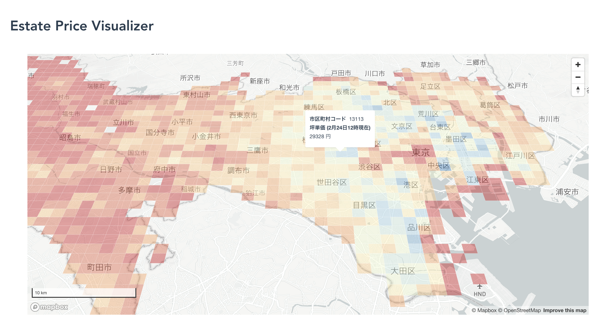

# estate_visualizer

Prototype of real estate price visualization tool.

## Example



## Prerequisites

### frontend

- nodejs: v12.16.1

- vue.js: 3.10.0

```bash
$ cd front-web
$ npm install

# run dev-server
$ npm run serve
```

`mapbox-gl` is used to draw maps on browser. You should sign up in https://www.mapbox.com/ and get access token.

### backend

- python: 3.7.5

- google chrome: 79.0.3945.130

```bash
$ cd batch
$ pip install -r requirements.txt
```

`selenium` on Google Chrome is used to collect price data of real estates. You should install `webdriver` compatible to version of chrome you are using.
